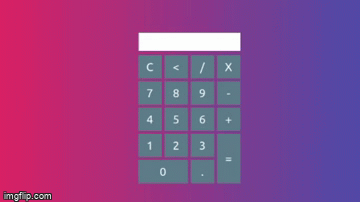

# HTML-CSS-JS-Calculator

Esse projeto foi baseado em um  video do youtube:

https://www.youtube.com/watch?v=JDiurjhpOXA&t=220s

Achei ele interessante é queria ver se na pratica ele realmente daria certo.

This project was based on a youtube video:

https://www.youtube.com/watch?v=JDiurjhpOXA&t=220s

I found it interesting and wanted to see if in practice it would really work.

## get started

Toda a modificação foi feita dentro do index.html, então basta copiar esse arquivo é abrir ele com um nevagador.

All the modification was done inside the index.html, so just copy this file and open it with a browser.
